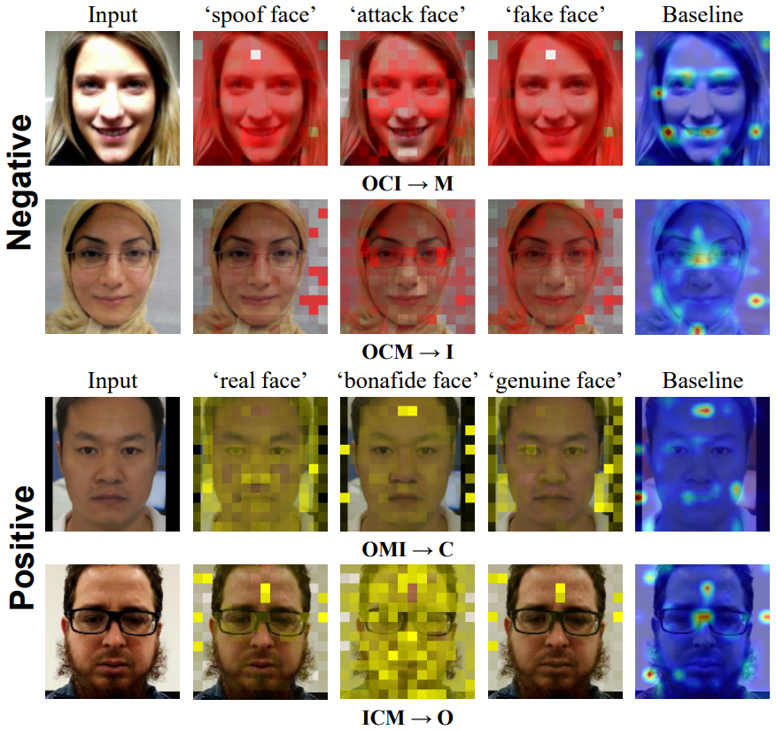

[ICCV 2025] Multi-View Slot Attention using Paraphrased Texts for Face Anti-Spoofing
=======================
CODE: Coming Soon


MVS visualization
=======================
 
-----------------------
Data preparation
=======================

- Data preprocessing

    - We follow FLIP's data preprocessing on Protocol 1 and 2 [(link)](https://github.com/koushiksrivats/FLIP/blob/main/docs/datasets.md)

- location of datasets 

    - Download each dataset from the links below and place them under the ```./dataset``` directory after preprocessing.
Each annotations are located under the provided dataset directory with our code.

- Protocol 1

    - MSU-MFSD (M) [(MSU)](https://sites.google.com/site/huhanhomepage/datasetcode).

    - CASIA-MFSD (C) [(Casia)](https://ieeexplore.ieee.org/document/6199754).

    - Replay-Attack (I) [(Replay)](https://www.idiap.ch/en/scientific-research/data/replayattack).

    - OULU-NPU (O) [(OULU)](https://sites.google.com/site/oulunpudatabase/).

- Protocol 2

    - WMCA (W) [(WMCA)](https://www.idiap.ch/en/scientific-research/data/wmca).

    - CASIA-SURF CeFA (C) [(CeFA)](https://sites.google.com/view/face-anti-spoofing-challenge/dataset-download/casia-surf-cefacvpr2020?authuser=0).

    - CASIA-SURF (S) [(SURF)](https://sites.google.com/view/face-anti-spoofing-challenge/dataset-download/casia-surfcvpr2019?authuser=0).


Dataset
-----------------------
```
MVP-FAS
└──────dataset
       └──────msu
       │      └──────test
       │      └──────train
       │      └──────msu_fake_test.txt
       │      └──────msu_fake_train.txt
       │      └──────msu_real_test.txt
       │      └──────msu_real_train.txt
       └──────casia
       │      └──────test
       │      └──────train
       │      └──────casia_fake_test.txt
       │      └──────casia_fake_train.txt
       │      └──────casia_real_test.txt
       │      └──────casia_real_train.txt
       └──────replay
       │      └──────test
       │      └──────train
       │      └──────replay_fake_test.txt
       │      └──────replay_fake_train.txt
       │      └──────replay_real_test.txt
       │      └──────replay_real_train.txt
       └──────oulu
       │      └──────test
       │      └──────train
       │      └──────oulu_fake_test.txt
       │      └──────oulu_fake_train.txt
       │      └──────oulu_real_test.txt
       │      └──────oulu_real_train.txt
       └──────wmca
       │      └──────test
       │      └──────train
       │      └──────wmca_fake_test.txt
       │      └──────wmca_fake_train.txt
       │      └──────wmca_real_test.txt
       │      └──────wmca_real_train.txt
       └──────cefa
       │      └──────test
       │      └──────train
       │      └──────cefa_fake_test.txt
       │      └──────cefa_fake_train.txt
       │      └──────cefa_real_test.txt
       │      └──────cefa_real_train.txt
       └──────surf
              └──────test
              └──────train
              └──────surf_fake_test.txt
              └──────surf_fake_train.txt
              └──────surf_real_test.txt
              └──────surf_real_train.txt
       
```
-----------------------
#Requirements
Create conda environment ```conda create -n MVP_FAS python=3.8```

Install pytorch 2.1.2 ```conda install pytorch==2.1.2 torchvision==0.16.2 torchaudio==2.1.2 pytorch-cuda=11.8 -c pytorch -c nvidia```

Other libraries are described in the ```./requirements.txt``` file.

And it can be downloaded with the following command ```pip install -r ./requirements.txt```

-----------------------
# Training
Protocol 1
-----------------------
Edit ```./config/cfg.py```
```
_C.TRAIN.LR = 1e-6
_C.TRAIN.EPOCH = 30
```

OCI -> M

Run ```./train.py```
```
python train.py --model MVP_FAS --save_name MVP_FAS --batch_size 18 --setting MCIO --train_dataset CIO --test_dataset M 
```
OMI -> C

Run ```./train.py```
```
python train.py --model MVP_FAS --save_name MVP_FAS --batch_size 18 --setting MCIO --train_dataset MIO --test_dataset C 
```
OCM -> I

Run ```./train.py```
```
python train.py --model MVP_FAS --save_name MVP_FAS --batch_size 18 --setting MCIO --train_dataset MCO --test_dataset I 
```
ICM -> O

Run ```./train.py```
```
python train.py --model MVP_FAS --save_name MVP_FAS --batch_size 18 --setting MCIO --train_dataset MCI --test_dataset O 
```

Protocol 2
-----------------------
Edit ```./config/cfg.py```
```
_C.TRAIN.LR = 1e-7
_C.TRAIN.EPOCH = 300
```

CS -> W

Run ```./train.py```
```
python train.py --model MVP_FAS --save_name MVP_FAS --batch_size 18 --setting SFW --train_dataset SF --test_dataset W 
```
SW -> C

Run ```./train.py```
```
python train.py --model MVP_FAS --save_name MVP_FAS --batch_size 18 --setting SFW --train_dataset SW --test_dataset F 
```
CW -> S

Run ```./train.py```
```
python train.py --model MVP_FAS --save_name MVP_FAS --batch_size 18 --setting SFW --train_dataset FW --test_dataset S 
```
-----------------------
For more details on training, see ```./reference/log```

# Testing
Protocol 1
-----------------------
Place the model you want to test under the ```./reference``` folder.


OCI -> M

Run ```./test.py```
```
python test.py --model MVP_FAS --save_name MVP_FAS --batch_size 18 --setting MCIO --train_dataset CIO --test_dataset M --checkpoint best_model.pth
```
OMI -> C

Run ```./test.py```
```
python test.py --model MVP_FAS --save_name MVP_FAS --batch_size 18 --setting MCIO --train_dataset MIO --test_dataset C --checkpoint best_model.pth 
```
OCM -> I

Run ```./test.py```
```
python test.py --model MVP_FAS --save_name MVP_FAS --batch_size 18 --setting MCIO --train_dataset MCO --test_dataset I --checkpoint best_model.pth 
```
ICM -> O

Run ```./test.py```
```
python test.py --model MVP_FAS --save_name MVP_FAS --batch_size 18 --setting MCIO --train_dataset MCI --test_dataset O --checkpoint best_model.pth 
```

Protocol 2
-----------------------
Place the model you want to test under the ```./reference``` folder.

CS -> W

Run ```./test.py```
```
python test.py --model MVP_FAS --save_name MVP_FAS --batch_size 18 --setting SFW --train_dataset SF --test_dataset W --checkpoint best_model.pth 
```
SW -> C

Run ```./test.py```
```
python test.py --model MVP_FAS --save_name MVP_FAS --batch_size 18 --setting SFW --train_dataset SW --test_dataset F --checkpoint best_model.pth 
```
CW -> S

Run ```./test.py```
```
python test.py --model MVP_FAS --save_name MVP_FAS --batch_size 18 --setting SFW --train_dataset FW --test_dataset S --checkpoint best_model.pth 
```


